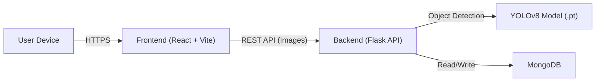

# FreshX - AI-Powered Fruit Freshness Detector 🍎🍌🍊


**FreshX** is a full-stack web application that detects and classifies fruit quality (Fresh vs. Rotten) in real-time. It uses **YOLOv8 Object Detection** to localize and identify multiple fruits within complex environments, providing confidence scores and detailed analytics.

## 🔗 Live Demo

- [👉 FreshX (Deployed Web)](https://www.freshx.site/)

&nbsp;

## 🎨 UI/UX

- [👉 FreshX UI/UX](https://www.figma.com/design/gQa1MOIKG2hE288m0PKQPB/Untitled?node-id=0-1&t=z1ziT4IT7Hxk5YLg-1)

&nbsp;

## 🚀 Features

### Core Detection

- **🍎 Multi-Fruit Detection:** Detects and displays ALL fruits in an image with individual confidence scores
- **📷 Live Camera with Auto-Scan:** Real-time detection from webcam with automatic 1-second interval scanning
- **🎯 Best Result Capture:** Auto-Scan saves only the highest confidence result to history

### Auto-Scan Technology

- **⚡ Realtime Capture:** Analyzes camera feed every 1 second automatically
- **📊 Live Feedback:** Shows capture count and best confidence in real-time

### Analytics & Export

- **📊 Smart Analytics Dashboard:** Pie charts and trend graphs of detection history
- **📄 PDF Export:** Generate professional reports with FreshX branding, summary statistics, and detection table
- **📥 CSV Export:** Download properly formatted data with dd/mm/yy timestamps

### Advanced History

- **🔍 Advanced Filtering:** Filter by date range, fruit type, and freshness status
- **📝 Detection Notes:** Add custom notes (e.g., "Warehouse A, Batch #102") to each scan

### Data Management

- **☁️ Cloud Sync:** Automatic save to MongoDB with device-based history
- **🗑️ History Management:** View, delete individual items, or clear all history

&nbsp;

## 🛠️ Tech Stack

### Frontend

| Technology      | Purpose            |
| --------------- | ------------------ |
| React 18 (Vite) | UI Framework       |
| Tailwind CSS    | Styling            |
| Recharts        | Charts & Analytics |
| Lucide React    | Icons              |
| jsPDF           | PDF Generation     |

### Backend

| Technology         | Purpose             |
| ------------------ | ------------------- |
| Flask (Python)     | REST API            |
| Ultralytics YOLOv8 | AI Object Detection |
| Pillow / NumPy     | Image Processing    |
| PyMongo            | Database Driver     |

### Database

| Technology | Purpose      |
| ---------- | ------------ |
| MongoDB    | Data Storage |

&nbsp;

## 🏗️ System Architecture



&nbsp;

## ⚙️ Local Installation Guide

### Prerequisites

- Python 3.10+
- Node.js 20+
- MongoDB (local or Atlas)

### 1. Clone the Repository

```bash
git clone https://github.com/Joeliazeers/FreshX.git
cd FreshX
```

### 2. Backend Setup

```bash
cd backend

# Create virtual environment
python -m venv venv

# Activate environment
# Windows:
venv\Scripts\activate
# Mac/Linux:
source venv/bin/activate

# Install dependencies
pip install -r requirements.txt

# Set MongoDB connection (replace with your URI)
# Windows PowerShell:
$env:MONGO_URI="mongodb://localhost:27017/"
# Mac/Linux:
export MONGO_URI="mongodb://localhost:27017/"

# Run the server
python app.py
```

### 3. Frontend Setup

```bash
cd frontend

# Install dependencies
npm install

# Create environment file
echo "VITE_API_URL=http://localhost:5000" > .env.local

# Run development server
npm run dev
```

&nbsp;

## 📡 API Documentation

| Method     | Endpoint        | Description                                                                              |
| ---------- | --------------- | ---------------------------------------------------------------------------------------- |
| **POST**   | `/predict`      | Analyze image. Use `save=false` for temp captures, `save=true` to persist to history.   |
| **GET**    | `/history`      | Fetch all past predictions for current device.                                           |
| **DELETE** | `/history/<id>` | Delete a single history record by ID.                                                    |
| **DELETE** | `/history`      | Clear entire history for current device.                                                 |

### POST /predict Request

```
FormData:
  - file: Image file (required)
  - save: "true" or "false" (default: "true")
  - notes: Optional notes string
```

### POST /predict Response

```json
{
  "label": "Fresh Apple",
  "confidence": 95.2,
  "is_fresh": true,
  "model_used": "YOLOv8",
  "heatmap_b64": "...",
  "detections": [
    {"label": "Fresh Apple", "confidence": 95.2, "is_fresh": true, "bbox": [x1, y1, x2, y2]},
    {"label": "Rotten Banana", "confidence": 87.5, "is_fresh": false, "bbox": [x1, y1, x2, y2]}
  ],
  "detection_count": 2
}
```

&nbsp;

## 📁 File Validation

| Constraint    | Value          |
| ------------- | -------------- |
| Allowed Types | PNG, JPG, JPEG |
| Max File Size | 5 MB           |

&nbsp;

## 📄 License

This project is created for educational purposes and assignment submission.
